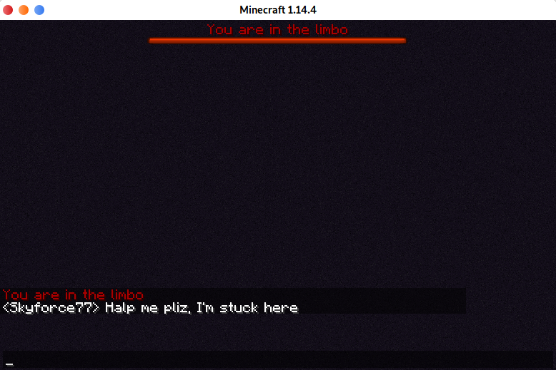

# TyphoonLimbo is no longer in active development. Try out [LOOHP's Limbo](https://github.com/LOOHP/Limbo "LOOHP/Limbo") (1.19)
---
# TyphoonLimbo
## Lightweight minecraft limbo server

[](https://travis-ci.org/TyphoonMC/TyphoonLimbo)

----
### What is a limbo server ?
A limbo server is a fallback server able to handle a massive amount of simultaneous connections. The player spawns into the void then waits here. It can be used to keep players connected to a network after a lobby crashed or as an afk server.



### Minecraft protocol support

See [TyphoonCore's protocol support](https://github.com/TyphoonMC/TyphoonCore#minecraft-protocol-support)

#### Snapshot support
TyphoonLimbo is able to load [TyphoonDep protocol-map modules](https://github.com/TyphoonMC/TyphoonDep/tree/master/protocol-map) to add a partial snapshots support.

All json files are loaded from the "modules" folder in the same directory as the TyphoonLimbo binary.

You can generate a protocol-map module with the [fetcher](https://github.com/TyphoonMC/TyphoonDep/tree/master/protocol-map/fetcher). Just pick the "page" link of your wanted version on [wiki.vg](http://wiki.vg/Protocol_version_numbers) as argument of the fecther and the magic will happen.

### How to build and start
```shell
git clone https://github.com/TyphoonMC/TyphoonLimbo.git
cd TyphoonLimbo
go build
./TyphoonLimbo
```
